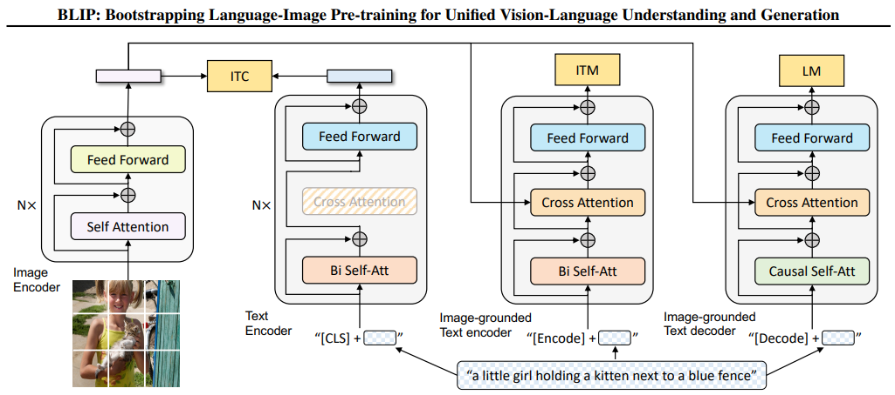

# CLIP Family
## CLIP

### [Learning Transferable Visual Models From Natural Language Supervision](https://arxiv.org/pdf/2103.00020.pdf)
-   Given a batch of N (image, text) pairs, CLIP is trained to
predict which of the N × N possible (image, text) pairings
across a batch actually occurred.
-   
    ```python
    # extract feature representations of each modality
    I_f = image_encoder(I) #[n, d_i]
    T_f = text_encoder(T) #[n, d_t]
    # joint multimodal embedding [n, d_e]
    I_e = l2_normalize(np.dot(I_f, W_i), axis=1)
    T_e = l2_normalize(np.dot(T_f, W_t), axis=1)
    # scaled pairwise cosine similarities [n, n]
    logits = np.dot(I_e, T_e.T) * np.exp(t)
    # symmetric loss function
    labels = np.arange(n)
    loss_i = cross_entropy_loss(logits, labels, axis=0)
    loss_t = cross_entropy_loss(logits, labels, axis=1)
    loss = (loss_i + loss_t)/2
    ```

## BLIP

### [BLIP: Bootstrapping Language-Image Pre-training for Unified Vision-Language Understanding and Generation](https://proceedings.mlr.press/v162/li22n/li22n.pdf)



- ITC Task: Image-Text Contrastive Training, like BLIP.
- ITM Task: Image-Text Matching, 
